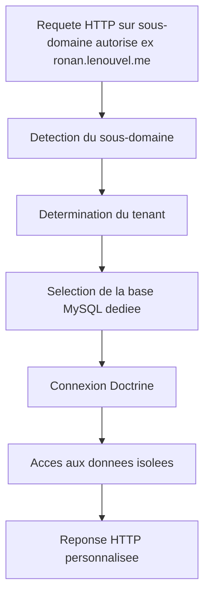

# Schéma conceptuel multi-tenant (multi-bases)

**Résumé** :

- Seuls les sous-domaines explicitement configures dans l’application (ex: ronan.lenouvel.me, elea.lenouvel.me, etc.) sont accessibles.
- Le domaine racine lenouvel.me n’est jamais accessible directement (toute requete doit etre faite via un sous-domaine declare).
- A chaque requete, Symfony detecte le sous-domaine, determine le tenant, puis selectionne dynamiquement la base de donnees MySQL dediee.
- Doctrine utilise la connexion appropriee pour garantir l’isolation stricte des donnees.
- Le coeur applicatif reste unique, seules les donnees sont isolees.

*Ce diagramme permet de se remettre rapidement dans le contexte multi-tenant/multi-bases du projet.*
