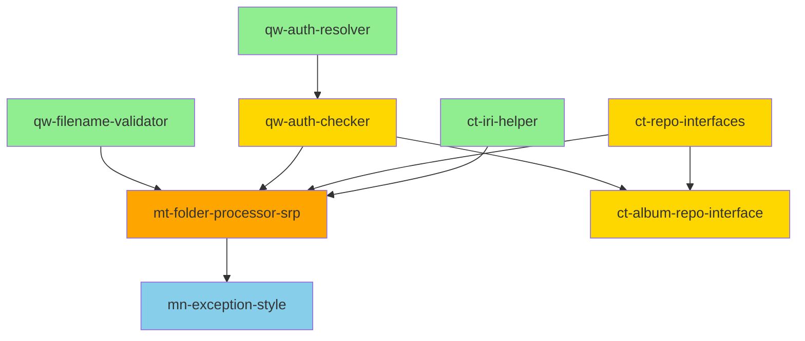

# Plan TDD — Refactoring SOLID / KISS / DRY (Version améliorée)

## Contexte

Audit réalisé sur `main` (après merge du chore/remove-dead-code).  
16 points identifiés. Ce plan couvre les actions correctives, organisées en 3 vagues.

**Objectifs** :

- Respecter les principes SOLID/KISS/DRY
- Garantir l'approche Stateless (12-Factor VI)
- Renforcer la sécurité (tri-endpoint)
- Améliorer l'observabilité (12-Factor XI)
- Préparer l'évolutivité (caching, DI avancé)

---

## Vague 1 — Quick wins (2-3 jours)

### `qw-filename-validator` — Extraire FilenameValidator

**Objectif** : Éliminer 4 duplications du regex de validation

**Actions** :

- Créer `src/Service/FilenameValidator.php` (service injectable, pas statique)

```php
  final readonly class FilenameValidator
  {
      public function __construct(
          private string $pattern,
          private LoggerInterface $logger
      ) {}

      public function validate(string $name, string $type): void
      {
          // Protection path traversal
          if (str_contains($name, '..') || str_contains($name, '/')) {
              $this->logger->warning('Path traversal attempt detected', [
                  'filename' => $name,
                  'type' => $type
              ]);
              throw new BadRequestHttpException('Invalid characters in filename');
          }

          // Protection null byte
          if (str_contains($name, "\0")) {
              throw new BadRequestHttpException('Null byte detected in filename');
          }

          // Validation longueur
          if (strlen($name) > 255) {
              throw new BadRequestHttpException('Filename too long (max 255 characters)');
          }

          // Regex métier
          if (!preg_match($this->pattern, $name)) {
              throw new BadRequestHttpException("Invalid {$type} name format");
          }
      }
  }

```

### Configuration (12-Factor III - Config)

```yaml
# config/services.yaml
parameters:
    app.filename.pattern: '%env(FILENAME_PATTERN)%'

services:
    App\Service\FilenameValidator:
        arguments:
            $pattern: '%app.filename.pattern%'

```

```dotenv
# .env.local
FILENAME_PATTERN='/^[a-zA-Z0-9_\-\.]+$/'
```

### Remplacer les 4 occurrences

- `FolderProcessor` (×2 : création + update)
- `AlbumProcessor`
- `FileActionService`

#### Tests

```php
// tests/Unit/Service/FilenameValidatorTest.php
final class FilenameValidatorTest extends TestCase
{
    private FilenameValidator $validator;

    protected function setUp(): void
    {
        $this->validator = new FilenameValidator(
            pattern: '/^[a-zA-Z0-9_\-\.]+$/',
            logger: $this->createMock(LoggerInterface::class)
        );
    }

    #[DataProvider('validFilenamesProvider')]
    public function testAcceptsValidFilenames(string $name, string $type): void
    {
        $this->validator->validate($name, $type);
        $this->expectNotToPerformAssertions();
    }

    #[DataProvider('invalidFilenamesProvider')]
    public function testRejectsInvalidFilenames(string $name, string $type): void
    {
        $this->expectException(BadRequestHttpException::class);
        $this->validator->validate($name, $type);
    }

    public static function validFilenamesProvider(): array
    {
        return [
            ['my-folder', 'folder'],
            ['album_2024.jpg', 'file'],
            ['test-123', 'album'],
        ];
    }

    public static function invalidFilenamesProvider(): array
    {
        return [
            'path traversal' => ['../etc/passwd', 'folder'],
            'null byte' => ["test\0.txt", 'file'],
            'too long' => [str_repeat('a', 256), 'album'],
            'special chars' => ['folder@#$', 'folder'],
            'forward slash' => ['folder/subfolder', 'folder'],
        ];
    }
}

```

#### ADR 001 : Centralisation de la validation des noms de fichiers

##### Contexte

4 duplications du même regex dans `FolderProcessor`, `AlbumProcessor`, `FileActionService`.  
Risques de sécurité (path traversal, null byte injection).

##### Décision

- Extraction dans `FilenameValidator` (service injectable)
- Ajout de validations de sécurité (path traversal, null byte, longueur)
- Externalisation du pattern dans `.env` (12-Factor III)
- Logging des tentatives suspectes (12-Factor XI)

##### Conséquences

- ✅ Single source of truth
- ✅ Testabilité améliorée
- ✅ Sécurité renforcée
- ✅ Configuration externalisée
- ⚠️ Breaking change si regex modifié (migration nécessaire)

**Convention de branche** : `refactor/FilenameValidator`

---

### `qw-auth-resolver` — Supprimer getAuthenticatedUser() dupliqué

**Objectif** : Éliminer 58 lignes de code dupliqué (29 × 2)

**Actions** :

- Injecter `AuthenticationResolver` dans `AlbumProcessor` et `FolderProcessor`
- Supprimer les méthodes privées `getAuthenticatedUser()`
- Ajouter du logging pour traçabilité

```php
// Avant
final class FolderProcessor implements ProcessorInterface
{
    private function getAuthenticatedUser(): User
    {
        $token = $this->tokenStorage->getToken();
        if (!$token) {
            throw new AccessDeniedException('No authentication token found');
        }
        // ... 25 lignes supplémentaires
    }
}

// Après
final class FolderProcessor implements ProcessorInterface
{
    public function __construct(
        private readonly AuthenticationResolver $authResolver,
        private readonly LoggerInterface $logger,
        // ... autres dépendances
    ) {}

    public function process(mixed $data, Operation $operation, array $uriVariables = [], array $context = []): Folder
    {
        $user = $this->authResolver->getAuthenticatedUser();
        
        $this->logger->info('Folder operation initiated', [
            'user_id' => $user->getId(),
            'operation' => $operation->getName(),
            'context' => 'folder_processor'
        ]);
        
        // ... logique métier
    }
}
```

#### Tests

```php
// tests/Functional/Processor/FolderProcessorTest.php
public function testRequiresAuthentication(): void
{
    $this->client->request('POST', '/api/folders', [
        'json' => ['name' => 'test-folder']
    ]);
    
    $this->assertResponseStatusCodeSame(401);
}

public function testLogsUserOperations(): void
{
    $this->loginAsUser();
    
    $this->client->request('POST', '/api/folders', [
        'json' => ['name' => 'test-folder']
    ]);
    
    $this->assertResponseIsSuccessful();
    // Vérifier que le log contient user_id et operation
}
```


**Convention de branche** : `refactor/AuthenticationResolver`

---

### `ct-iri-helper` — Extraire le nettoyage IRI

**Objectif** : Centraliser l'extraction UUID depuis IRI (3 duplications)

**Actions** :

- Créer `src/Service/IriExtractor.php` (service injectable)

```php
final readonly class IriExtractor
{
    public function __construct(
        private LoggerInterface $logger
    ) {}

    public function extractUuid(string $iri): string
    {
        if (!preg_match('#/([a-f0-9-]{36})$#', $iri, $matches)) {
            $this->logger->error('Invalid IRI format', [
                'iri' => $iri,
                'context' => 'iri_extractor'
            ]);
            throw new BadRequestHttpException('Invalid IRI format');
        }
        
        return $matches[1];
    }

    /**
     * Extrait plusieurs UUIDs depuis un tableau d'IRIs
     * @param string[] $iris
     * @return string[]
     */
    public function extractUuids(array $iris): array
    {
        return array_map(
            fn(string $iri) => $this->extractUuid($iri),
            $iris
        );
    }
}
```

### Remplacer les 3 occurrences dans

- `FolderProcessor`
- `FileProcessor`
- `ShareProcessor`

#### Tests

```php
// tests/Unit/Service/IriExtractorTest.php
final class IriExtractorTest extends TestCase
{
    private IriExtractor $extractor;

    protected function setUp(): void
    {
        $this->extractor = new IriExtractor(
            logger: $this->createMock(LoggerInterface::class)
        );
    }

    public function testExtractsValidUuid(): void
    {
        $uuid = '550e8400-e29b-41d4-a716-446655440000';
        $iri = "/api/folders/{$uuid}";
        
        $result = $this->extractor->extractUuid($iri);
        
        $this->assertSame($uuid, $result);
    }

    #[DataProvider('invalidIrisProvider')]
    public function testRejectsInvalidIris(string $iri): void
    {
        $this->expectException(BadRequestHttpException::class);
        $this->extractor->extractUuid($iri);
    }

    public static function invalidIrisProvider(): array
    {
        return [
            'no uuid' => ['/api/folders'],
            'invalid uuid' => ['/api/folders/not-a-uuid'],
            'partial uuid' => ['/api/folders/550e8400'],
            'empty string' => [''],
        ];
    }

    public function testExtractsMultipleUuids(): void
    {
        $uuids = [
            '550e8400-e29b-41d4-a716-446655440000',
            '6ba7b810-9dad-11d1-80b4-00c04fd430c8',
        ];
        $iris = array_map(fn($uuid) => "/api/folders/{$uuid}", $uuids);
        
        $result = $this->extractor->extractUuids($iris);
        
        $this->assertSame($uuids, $result);
    }
}
```

**Convention de branche** : `refactor/IriExtractor`

---

## Vague 2 — Court terme

### `ct-repo-interfaces` — Créer les interfaces de repository manquantes

**Objectif** : Respecter le Dependency Inversion Principle (SOLID D)

**Actions** :

- Créer les interfaces dans `src/Interface/` :

```php
// src/Interface/FolderRepositoryInterface.php
interface FolderRepositoryInterface
{
    public function find(string $id): ?Folder;
    
    /** @return Folder[] */
    public function findByOwner(User $user): array;
    
    public function save(Folder $folder, bool $flush = true): void;
    
    public function remove(Folder $folder, bool $flush = true): void;
}

// src/Interface/UserRepositoryInterface.php
interface UserRepositoryInterface
{
    public function find(string $id): ?User;
    
    public function findOneByEmail(string $email): ?User;
    
    public function save(User $user, bool $flush = true): void;
}

// src/Interface/ShareRepositoryInterface.php
interface ShareRepositoryInterface
{
    public function find(string $id): ?Share;
    
    /** @return Share[] */
    public function findByOwner(User $user): array;
    
    /** @return Share[] */
    public function findBySharedWith(User $user): array;
    
    public function save(Share $share, bool $flush = true): void;
    
    public function remove(Share $share, bool $flush = true): void;
}
```

#### Implémenter les interfaces dans les repositories existants

```php
// src/Repository/FolderRepository.php
final class FolderRepository extends ServiceEntityRepository implements FolderRepositoryInterface
{
    // ... implémentation existante
}
```

#### Configuration des services

```yaml
# config/services.yaml
services:
    # Bind automatique des interfaces
    App\Interface\FolderRepositoryInterface: '@App\Repository\FolderRepository'
    App\Interface\UserRepositoryInterface: '@App\Repository\UserRepository'
    App\Interface\ShareRepositoryInterface: '@App\Repository\ShareRepository'
```

#### Mettre à jour les injections dans

- `FolderProcessor`
- `ShareProcessor`
- `FileProcessor`
- `AlbumProcessor`
- `FileWebController`
- `AlbumAddMediaController`

#### Tests

```php
// tests/Integration/Repository/FolderRepositoryTest.php
final class FolderRepositoryTest extends KernelTestCase
{
    private FolderRepositoryInterface $repository;

    protected function setUp(): void
    {
        self::bootKernel();
        $this->repository = self::getContainer()->get(FolderRepositoryInterface::class);
    }

    public function testImplementsInterface(): void
    {
        $this->assertInstanceOf(FolderRepositoryInterface::class, $this->repository);
    }

    public function testFindByOwner(): void
    {
        $user = $this->createUser();
        $folder = $this->createFolder(owner: $user);
        
        $folders = $this->repository->findByOwner($user);
        
        $this->assertContains($folder, $folders);
    }
}
```

**Convention de branche** : `feat/RepositoryInterfaces`

---

### `qw-auth-checker` — Centraliser l'ownership via AuthorizationChecker

**Objectif** : Éliminer 5+ checks manuels `getOwner()->getId() === $user->getId()`

**Actions** :

- Créer un service dédié `src/Security/OwnershipChecker.php` :

```php
final readonly class OwnershipChecker
{
    public function __construct(
        private AuthenticationResolver $authResolver,
        private LoggerInterface $logger
    ) {}

    public function isOwner(Folder|Album|Share $resource): bool
    {
        $user = $this->authResolver->getAuthenticatedUser();
        $isOwner = $resource->getOwner()->equals($user);
        
        if (!$isOwner) {
            $this->logger->warning('Ownership check failed', [
                'user_id' => $user->getId(),
                'resource_type' => $resource::class,
                'resource_id' => $resource->getId(),
                'owner_id' => $resource->getOwner()->getId(),
            ]);
        }
        
        return $isOwner;
    }

    public function denyUnlessOwner(Folder|Album|Share $resource): void
    {
        if (!$this->isOwner($resource)) {
            throw new AccessDeniedException('You are not the owner of this resource');
          }
    }
}

```

#### Remplacer les checks manuels dans

- `FolderProcessor`
- `AlbumProcessor`
- `FileWebController`
- `ShareProcessor`

**Exemple de refactoring** :

```php
// Avant
final class FolderProcessor implements ProcessorInterface
{
    public function process(mixed $data, Operation $operation, array $uriVariables = [], array $context = []): Folder
    {
        $user = $this->authResolver->getAuthenticatedUser();
        $folder = $this->folderRepository->find($uriVariables['id']);
        
        if ($folder->getOwner()->getId() !== $user->getId()) {
            throw new AccessDeniedException('Not your folder');
        }
        
        // ... logique métier
    }
}

// Après
final class FolderProcessor implements ProcessorInterface
{
    public function __construct(
        private readonly OwnershipChecker $ownershipChecker,
        // ... autres dépendances
    ) {}

    public function process(mixed $data, Operation $operation, array $uriVariables = [], array $context = []): Folder
    {
        $folder = $this->folderRepository->find($uriVariables['id']);
        $this->ownershipChecker->denyUnlessOwner($folder);
        
        // ... logique métier
    }
}
```

#### Tests de sécurité

```php
// tests/Security/OwnershipCheckerTest.php
final class OwnershipCheckerTest extends KernelTestCase
{
    private OwnershipChecker $checker;

    protected function setUp(): void
    {
        self::bootKernel();
        $this->checker = self::getContainer()->get(OwnershipChecker::class);
    }

    public function testAllowsOwnerAccess(): void
    {
        $user = $this->createUser();
        $folder = $this->createFolder(owner: $user);
        $this->loginAs($user);
        
        $result = $this->checker->isOwner($folder);
        
        $this->assertTrue($result);
    }

    public function testDeniesNonOwnerAccess(): void
    {
        $owner = $this->createUser();
        $otherUser = $this->createUser();
        $folder = $this->createFolder(owner: $owner);
        $this->loginAs($otherUser);
        
        $result = $this->checker->isOwner($folder);
        
        $this->assertFalse($result);
    }

    public function testThrowsExceptionForNonOwner(): void
    {
        $owner = $this->createUser();
        $otherUser = $this->createUser();
        $folder = $this->createFolder(owner: $owner);
        $this->loginAs($otherUser);
        
        $this->expectException(AccessDeniedException::class);
        $this->checker->denyUnlessOwner($folder);
    }
}

// tests/Functional/Security/FolderOwnershipTest.php
final class FolderOwnershipTest extends WebTestCase
{
    public function testUserCannotAccessOthersFolder(): void
    {
        $owner = $this->createUser();
        $otherUser = $this->createUser();
        $folder = $this->createFolder(owner: $owner);
        
        $this->loginAs($otherUser);
        $this->client->request('GET', "/api/folders/{$folder->getId()}");
        
        $this->assertResponseStatusCodeSame(403);
    }

    public function testUserCannotUpdateOthersFolder(): void
    {
        $owner = $this->createUser();
        $otherUser = $this->createUser();
        $folder = $this->createFolder(owner: $owner);
        
        $this->loginAs($otherUser);
        $this->client->request('PATCH', "/api/folders/{$folder->getId()}", [
            'json' => ['name' => 'hacked-name']
        ]);
        
        $this->assertResponseStatusCodeSame(403);
    }

    public function testUserCannotDeleteOthersFolder(): void
    {
        $owner = $this->createUser();
        $otherUser = $this->createUser();
        $folder = $this->createFolder(owner: $owner);
        
        $this->loginAs($otherUser);
        $this->client->request('DELETE', "/api/folders/{$folder->getId()}");
        
        $this->assertResponseStatusCodeSame(403);
    }
}
```

#### ADR 002 : Centralisation des vérifications d'ownership

##### Contexte

5+ duplications de la logique `getOwner()->getId() === $user->getId()`.  
Risques de sécurité si un check est oublié ou mal implémenté.

##### Décision

- Création de `OwnershipChecker` avec méthodes `isOwner()` et `denyUnlessOwner()`
- Utilisation de `User::equals()` au lieu de comparaison d'IDs
- Logging systématique des tentatives d'accès non autorisées
- Tests de non-régression pour chaque type de ressource

##### Conséquences

- ✅ Single source of truth pour les checks d'ownership
- ✅ Traçabilité des tentatives d'accès (logs)
- ✅ Meilleure couverture de tests de sécurité
- ✅ Facilite l'ajout de nouvelles ressources
- ⚠️ Nécessite que toutes les entités implémentent `getOwner()`

**Convention de branche** : `refactor/OwnershipChecker`  
**Dépend de** : `qw-auth-resolver`

---

### `ct-album-repo-interface` — Utiliser AlbumRepositoryInterface

**Objectif** : Compléter l'inversion de dépendances pour `Album`

**Actions** :

- Remplacer l'injection concrète `AlbumRepository` par `AlbumRepositoryInterface` dans :
  - `AlbumProcessor`
  - `AlbumAddMediaController`

**Exemple** :

```php
// Avant
final class AlbumProcessor implements ProcessorInterface
{
    public function __construct(
        private readonly AlbumRepository $albumRepository,
        // ...
    ) {}
}

// Après
final class AlbumProcessor implements ProcessorInterface
{
    public function __construct(
        private readonly AlbumRepositoryInterface $albumRepository,
        // ...
    ) {}
}
```

#### Tests

```php
// tests/Unit/Processor/AlbumProcessorTest.php
public function testUsesAlbumRepositoryInterface(): void
{
    $reflection = new \ReflectionClass(AlbumProcessor::class);
    $constructor = $reflection->getConstructor();
    $parameters = $constructor->getParameters();
    
    $albumRepoParam = array_filter(
        $parameters,
        fn($p) => $p->getName() === 'albumRepository'
    );
    
    $this->assertCount(1, $albumRepoParam);
    $type = reset($albumRepoParam)->getType();
    $this->assertSame(AlbumRepositoryInterface::class, $type->getName());
}
```

**Convention de branche** : `refactor/AlbumRepositoryInterface`  
**Dépend de** : `ct-repo-interfaces`, `qw-auth-checker`

---

## Vague 3 — Moyen terme

### `mt-folder-processor-srp` — Éclater FolderProcessor (SRP)

**Objectif** : Respecter le Single Responsibility Principle

**Actions** :

- Créer `src/Service/FolderService.php` pour la logique métier :

```php
final readonly class FolderService
{
    public function __construct(
        private FolderRepositoryInterface $folderRepository,
        private FilenameValidator $filenameValidator,
        private OwnershipChecker $ownershipChecker,
        private LoggerInterface $logger,
        private StopwatchInterface $stopwatch
    ) {}

    public function create(User $owner, array $data): Folder
    {
        $event = $this->stopwatch->start('folder.create');
        
        $this->filenameValidator->validate($data['name'], 'folder');
        
        $folder = new Folder();
        $folder->setName($data['name']);
        $folder->setOwner($owner);
        
        if (isset($data['parent'])) {
            $parent = $this->folderRepository->find($data['parent']);
            $this->ownershipChecker->denyUnlessOwner($parent);
            $folder->setParent($parent);
        }
        
        $this->folderRepository->save($folder);
        
        $event->stop();
        $this->logger->info('Folder created', [
            'folder_id' => $folder->getId(),
            'owner_id' => $owner->getId(),
            'duration_ms' => $event->getDuration(),
            'context' => 'folder_service'
        ]);
        
        return $folder;
    }

    public function update(Folder $folder, array $data): Folder
    {
        $event = $this->stopwatch->start('folder.update');
        
        $this->ownershipChecker->denyUnlessOwner($folder);
        
        if (isset($data['name'])) {
            $this->filenameValidator->validate($data['name'], 'folder');
            $folder->setName($data['name']);
        }
        
        if (isset($data['parent'])) {
            $parent = $this->folderRepository->find($data['parent']);
            $this->ownershipChecker->denyUnlessOwner($parent);
            $folder->setParent($parent);
        }
        
        $this->folderRepository->save($folder);
        
        $event->stop();
        $this->logger->info('Folder updated', [
            'folder_id' => $folder->getId(),
            'duration_ms' => $event->getDuration(),
            'context' => 'folder_service'
        ]);
        
        return $folder;
    }

    public function delete(Folder $folder): void
    {
        $event = $this->stopwatch->start('folder.delete');
        
        $this->ownershipChecker->denyUnlessOwner($folder);
        
        $folderId = $folder->getId();
        $this->folderRepository->remove($folder);
        
        $event->stop();
        $this->logger->info('Folder deleted', [
            'folder_id' => $folderId,
            'duration_ms' => $event->getDuration(),
            'context' => 'folder_service'
        ]);
    }
}
```

- Simplifier `FolderProcessor` (rôle de dispatch uniquement) :

```php
final readonly class FolderProcessor implements ProcessorInterface
{
    public function __construct(
        private FolderService $folderService,
        private FolderRepositoryInterface $folderRepository,
        private AuthenticationResolver $authResolver
    ) {}

    public function process(mixed $data, Operation $operation, array $uriVariables = [], array $context = []): Folder
    {
        $user = $this->authResolver->getAuthenticatedUser();
        
        return match ($operation->getName()) {
            '_api_/folders_post' => $this->folderService->create($user, $data),
            '_api_/folders/{id}_patch' => $this->handleUpdate($uriVariables['id'], $data),
            '_api_/folders/{id}_delete' => $this->handleDelete($uriVariables['id']),
            default => throw new \LogicException('Unsupported operation')
        };
    }

    private function handleUpdate(string $id, array $data): Folder
    {
        $folder = $this->folderRepository->find($id);
        if (!$folder) {
            throw new NotFoundHttpException('Folder not found');
        }
        
        return $this->folderService->update($folder, $data);
    }

    private function handleDelete(string $id): Folder
    {
        $folder = $this->folderRepository->find($id);
        if (!$folder) {
            throw new NotFoundHttpException('Folder not found');
        }
        
        $this->folderService->delete($folder);
        return $folder; // API Platform nécessite un retour
    }
}
```

#### Option avancée : 3 processors distincts par opération

```yaml
# config/api_platform/folder.yaml
App\Entity\Folder:
    operations:
        post:
            processor: App\State\Processor\FolderCreateProcessor
        patch:
            processor: App\State\Processor\FolderUpdateProcessor
        delete:
            processor: App\State\Processor\FolderDeleteProcessor
```

#### Tests

```php
// tests/Unit/Service/FolderServiceTest.php
final class FolderServiceTest extends TestCase
{
    private FolderService $service;
    private FolderRepositoryInterface $repository;
    private FilenameValidator $validator;
    private OwnershipChecker $ownershipChecker;
    private LoggerInterface $logger;
    private Stopwatch $stopwatch;

    protected function setUp(): void
    {
        $this->repository     = $this->createMock(FolderRepositoryInterface::class);
        $this->validator      = $this->createMock(FilenameValidator::class);
        $this->ownershipChecker = $this->createMock(OwnershipChecker::class);
        $this->logger         = $this->createMock(LoggerInterface::class);
        $this->stopwatch      = new Stopwatch();

        $this->service = new FolderService(
            folderRepository: $this->repository,
            filenameValidator: $this->validator,
            ownershipChecker: $this->ownershipChecker,
            logger: $this->logger,
            stopwatch: $this->stopwatch
        );
    }

    public function testCreateValidatesFilename(): void
    {
        $user = $this->createUser();

        $this->validator
            ->expects($this->once())
            ->method('validate')
            ->with('test-folder', 'folder');

        $this->service->create($user, ['name' => 'test-folder']);
    }

    public function testCreateSavesFolder(): void
    {
        $user = $this->createUser();

        $this->repository
            ->expects($this->once())
            ->method('save')
            ->with($this->isInstanceOf(Folder::class));

        $this->service->create($user, ['name' => 'test-folder']);
    }

    public function testCreateLogsOperation(): void
    {
        $user = $this->createUser();

        $this->logger
            ->expects($this->once())
            ->method('info')
            ->with('Folder created', $this->callback(
                fn($ctx) => isset($ctx['folder_id'])
                    && $ctx['owner_id'] === $user->getId()
                    && isset($ctx['duration_ms'])
                    && $ctx['context'] === 'folder_service'
            ));

        $this->service->create($user, ['name' => 'test-folder']);
    }

    public function testUpdateChecksOwnership(): void
    {
        $folder = $this->createFolder();

        $this->ownershipChecker
            ->expects($this->once())
            ->method('denyUnlessOwner')
            ->with($folder);

        $this->service->update($folder, ['name' => 'new-name']);
    }

    public function testUpdateValidatesNewName(): void
    {
        $folder = $this->createFolder();

        $this->validator
            ->expects($this->once())
            ->method('validate')
            ->with('new-name', 'folder');

        $this->service->update($folder, ['name' => 'new-name']);
    }

    public function testUpdateDoesNotValidateIfNameUnchanged(): void
    {
        $folder = $this->createFolder();

        $this->validator
            ->expects($this->never())
            ->method('validate');

        $this->service->update($folder, ['parent' => '/api/folders/123']);
    }

    public function testDeleteChecksOwnership(): void
    {
        $folder = $this->createFolder();

        $this->ownershipChecker
            ->expects($this->once())
            ->method('denyUnlessOwner')
            ->with($folder);

        $this->service->delete($folder);
    }

    public function testDeleteRemovesFolder(): void
    {
        $folder = $this->createFolder();

        $this->repository
            ->expects($this->once())
            ->method('remove')
            ->with($folder);

        $this->service->delete($folder);
    }

    public function testDeleteLogsOperation(): void
    {
        $folder    = $this->createFolder();
        $folderId  = $folder->getId();

        $this->logger
            ->expects($this->once())
            ->method('info')
            ->with('Folder deleted', $this->callback(
                fn($ctx) => $ctx['folder_id'] === $folderId
                    && isset($ctx['duration_ms'])
                    && $ctx['context'] === 'folder_service'
            ));

        $this->service->delete($folder);
    }
}

// tests/Functional/Service/FolderServiceIntegrationTest.php
final class FolderServiceIntegrationTest extends KernelTestCase
{
    private FolderService $service;
    private EntityManagerInterface $entityManager;

    protected function setUp(): void
    {
        self::bootKernel();
        $this->service       = self::getContainer()->get(FolderService::class);
        $this->entityManager = self::getContainer()->get(EntityManagerInterface::class);
    }

    protected function tearDown(): void
    {
        $this->entityManager->createQuery('DELETE FROM App\Entity\Folder')->execute();
        $this->entityManager->createQuery('DELETE FROM App\Entity\User')->execute();
        parent::tearDown();
    }

    public function testCreateFolderPersistsToDatabase(): void
    {
        $user   = $this->createAndPersistUser();
        $folder = $this->service->create($user, ['name' => 'integration-test-folder']);

        $this->entityManager->clear();

        $persisted = $this->entityManager->getRepository(Folder::class)->find($folder->getId());

        $this->assertNotNull($persisted);
        $this->assertSame('integration-test-folder', $persisted->getName());
        $this->assertSame($user->getId(), $persisted->getOwner()->getId());
    }

    public function testCreateFolderWithParent(): void
    {
        $user   = $this->createAndPersistUser();
        $parent = $this->createAndPersistFolder($user, 'parent-folder');

        $folder = $this->service->create($user, [
            'name'   => 'child-folder',
            'parent' => $parent->getId(),
        ]);

        $this->assertSame($parent->getId(), $folder->getParent()->getId());
    }

    public function testUpdateFolderName(): void
    {
        $user   = $this->createAndPersistUser();
        $folder = $this->createAndPersistFolder($user, 'old-name');

        $this->service->update($folder, ['name' => 'new-name']);
        $this->entityManager->refresh($folder);

        $this->assertSame('new-name', $folder->getName());
    }

    public function testDeleteFolderRemovesFromDatabase(): void
    {
        $user     = $this->createAndPersistUser();
        $folder   = $this->createAndPersistFolder($user, 'to-delete');
        $folderId = $folder->getId();

        $this->service->delete($folder);
        $this->entityManager->clear();

        $this->assertNull($this->entityManager->getRepository(Folder::class)->find($folderId));
    }
}

// tests/Functional/Processor/FolderProcessorTest.php
final class FolderProcessorTest extends WebTestCase
{
    public function testCreateFolderViaApi(): void
    {
        $this->loginAsUser();
        $this->client->request('POST', '/api/folders', [
            'json' => ['name' => 'api-test-folder'],
        ]);

        $this->assertResponseStatusCodeSame(201);
        $this->assertJsonContains(['name' => 'api-test-folder']);
    }

    public function testUpdateFolderViaApi(): void
    {
        $user   = $this->createUser();
        $folder = $this->createFolder(owner: $user, name: 'old-name');
        $this->loginAs($user);

        $this->client->request('PATCH', "/api/folders/{$folder->getId()}", [
            'json'    => ['name' => 'updated-name'],
            'headers' => ['Content-Type' => 'application/merge-patch+json'],
        ]);

        $this->assertResponseIsSuccessful();
        $this->assertJsonContains(['name' => 'updated-name']);
    }

    public function testDeleteFolderViaApi(): void
    {
        $user   = $this->createUser();
        $folder = $this->createFolder(owner: $user);
        $this->loginAs($user);

        $this->client->request('DELETE', "/api/folders/{$folder->getId()}");

        $this->assertResponseStatusCodeSame(204);
    }

    public function testCannotCreateFolderWithInvalidName(): void
    {
        $this->loginAsUser();
        $this->client->request('POST', '/api/folders', [
            'json' => ['name' => '../etc/passwd'],
        ]);

        $this->assertResponseStatusCodeSame(400);
    }

    public function testCannotUpdateOtherUserFolder(): void
    {
        $owner     = $this->createUser();
        $otherUser = $this->createUser();
        $folder    = $this->createFolder(owner: $owner);
        $this->loginAs($otherUser);

        $this->client->request('PATCH', "/api/folders/{$folder->getId()}", [
            'json'    => ['name' => 'hacked'],
            'headers' => ['Content-Type' => 'application/merge-patch+json'],
        ]);

        $this->assertResponseStatusCodeSame(403);
    }
}
```

#### ADR 003 : Séparation des responsabilités dans FolderProcessor

##### Contexte

`FolderProcessor` mélange : logique de dispatch API Platform, validation métier,
persistance, logging et gestion des erreurs. Violation du Single Responsibility Principle.

##### Décision

- Extraction de la logique métier dans `FolderService`
- `FolderProcessor` devient un simple dispatcher
- `FolderService` est stateless (12-Factor VI)
- Ajout de métriques de performance (`Stopwatch`)
- Logging structuré pour chaque opération

##### Architecture

```
┌─────────────────┐
│   API Platform  │
└────────┬────────┘
         │
         ▼
┌─────────────────┐
│ FolderProcessor │ ◄── Dispatch uniquement
└────────┬────────┘
         │
         ▼
┌─────────────────┐
│  FolderService  │ ◄── Logique métier
└────────┬────────┘
         │
         ├──► FilenameValidator
         ├──► OwnershipChecker
         ├──► FolderRepository
         └──► Logger
```

##### Conséquences

- ✅ Testabilité améliorée (service isolé)
- ✅ Réutilisabilité (service utilisable hors API)
- ✅ Observabilité (métriques + logs structurés)
- ✅ Respect du SRP
- ✅ Stateless garanti (12-Factor VI)
- ⚠️ Légère augmentation du nombre de classes
- ⚠️ Nécessite de maintenir la cohérence entre Processor et Service

##### Évolutions futures

- Possibilité de créer 3 processors distincts (Create/Update/Delete)
- Ajout de cache sur les opérations de lecture
- Intégration d'événements Symfony (`FolderCreatedEvent`, etc.)

**Convention de branche** : `refactor/FolderProcessorSRP`  
**Dépend de** : `qw-auth-resolver`, `qw-auth-checker`, `ct-repo-interfaces`, `qw-filename-validator`

---

## Mineurs (regroupés)

### `mn-exception-style` — Uniformiser exceptions et style throw

**Objectif** : Cohérence du code et respect des conventions HTTP

**Actions** :

- Remplacer `\InvalidArgumentException` par `BadRequestHttpException` dans les contextes HTTP
- Standardiser `?? throw` vs `if/throw` sur tout le projet

**Règles** :

```php
// ✅ Préférer pour les validations simples (null-coalescing throw)
$folder = $this->repository->find($id)
    ?? throw new NotFoundHttpException('Folder not found');

// ✅ Préférer pour les validations complexes
if (!$this->ownershipChecker->isOwner($folder)) {
    throw new AccessDeniedException('You are not the owner of this resource');
}

// ❌ Éviter les exceptions génériques dans les controllers/processors
throw new \InvalidArgumentException('Invalid data');

// ✅ Utiliser les exceptions HTTP appropriées
throw new BadRequestHttpException('Invalid data');
```

**Mapping des exceptions** :

```php
\InvalidArgumentException  → BadRequestHttpException   (400)
\RuntimeException          → HttpException             (500)
\LogicException            → HttpException             (500)
// Custom business exceptions → Conserver (avec listener pour conversion HTTP)
```

**Exemple de refactoring** :

```php
// Avant
if (!isset($data['name'])) {
    throw new \InvalidArgumentException('Name is required');
}
$folder = $this->repository->find($uriVariables['id']);
if (!$folder) {
    throw new \RuntimeException('Folder not found');
}

// Après
if (!isset($data['name'])) {
    throw new BadRequestHttpException('Name is required');
}
$folder = $this->repository->find($uriVariables['id'])
    ?? throw new NotFoundHttpException('Folder not found');
```

**Fichiers concernés** :

- `FolderProcessor`
- `AlbumProcessor`
- `FileProcessor`
- `ShareProcessor`
- `FileActionService`
- `FileWebController`
- `AlbumAddMediaController`

#### Tests

```php
// tests/Unit/Exception/ExceptionStyleTest.php
final class ExceptionStyleTest extends TestCase
{
    /** @dataProvider processorProvider */
    public function testProcessorsUseHttpExceptions(string $processorClass): void
    {
        $reflection = new \ReflectionClass($processorClass);
        $source     = file_get_contents($reflection->getFileName());

        $this->assertStringNotContainsString(
            'throw new \InvalidArgumentException',
            $source,
            "{$processorClass} should not throw InvalidArgumentException"
        );
        $this->assertStringNotContainsString(
            'throw new \RuntimeException',
            $source,
            "{$processorClass} should not throw RuntimeException"
        );
    }

    public static function processorProvider(): array
    {
        return [
            [FolderProcessor::class],
            [AlbumProcessor::class],
            [FileProcessor::class],
            [ShareProcessor::class],
        ];
    }
}

// tests/Functional/Exception/ExceptionHandlingTest.php
final class ExceptionHandlingTest extends WebTestCase
{
    public function testInvalidDataReturns400(): void
    {
        $this->loginAsUser();
        $this->client->request('POST', '/api/folders', ['json' => ['invalid' => 'data']]);

        $this->assertResponseStatusCodeSame(400);
    }

    public function testNotFoundResourceReturns404(): void
    {
        $this->loginAsUser();
        $this->client->request('GET', '/api/folders/00000000-0000-0000-0000-000000000000');

        $this->assertResponseStatusCodeSame(404);
    }

    public function testUnauthorizedAccessReturns403(): void
    {
        $owner     = $this->createUser();
        $otherUser = $this->createUser();
        $folder    = $this->createFolder(owner: $owner);
        $this->loginAs($otherUser);

        $this->client->request('DELETE', "/api/folders/{$folder->getId()}");

        $this->assertResponseStatusCodeSame(403);
    }
}
```

**Convention de branche** : `refactor/ExceptionStyle`

---

## Workflow Git

### Création de branche

```bash
git checkout main
git pull origin main
git checkout -b refactor/FilenameValidator
```

### Développement TDD

```bash
# RED : écrire le test qui échoue
php bin/phpunit tests/Unit/Service/FilenameValidatorTest.php

# GREEN : implémenter le code minimal
# Relancer les tests jusqu'à ce qu'ils passent

# REFACTOR : améliorer le code sans casser les tests
```

### Commits atomiques

```bash
git add src/Service/FilenameValidator.php
git commit -m "✨ feat(FilenameValidator): ajout du service avec protections sécurité"

git add tests/Unit/Service/FilenameValidatorTest.php
git commit -m "✅ test(FilenameValidatorTest): couverture validation et cas limites"

git add config/services.yaml
git commit -m "🛠️ chore(services): enregistrement FilenameValidator avec pattern env"

git add src/State/FolderProcessor.php
git commit -m "♻️ refactor(FolderProcessor): utilisation FilenameValidator"
```

### Push, PR et merge

```bash
git push origin refactor/FilenameValidator
# Créer la PR sur GitHub
# Attendre validation des pipelines (tests, PHPStan, CS Fixer)

# Après approbation et pipelines verts
git checkout main
git pull origin main
git branch -d refactor/FilenameValidator
git fetch --prune
```

### Mise à jour de l'avancement

```bash
git add .github/avancement.md
git commit -m "📋 chore(avancement): mise à jour FilenameValidator — done"
git push origin main
```

---

## Template PR

```markdown
## 🎯 Objectif
<!-- Décrire l'objectif du refactoring -->

## 📋 Checklist Refactoring

### Code Quality
- [ ] Tests unitaires ajoutés (couverture > 80%)
- [ ] Tests fonctionnels mis à jour si nécessaire
- [ ] PHPStan niveau 8 passe sans erreur
- [ ] PHP CS Fixer appliqué (PSR-12)
- [ ] Pas de code mort introduit

### Architecture
- [ ] Aucun état persistant introduit (stateless — 12-Factor VI)
- [ ] Dépendances injectées via constructeur (DI)
- [ ] Interfaces utilisées pour les dépendances externes
- [ ] Respect des principes SOLID

### Sécurité
- [ ] Validation des entrées utilisateur
- [ ] Protection contre les injections (SQL, path traversal, etc.)
- [ ] Tests de non-régression pour les autorisations
- [ ] Aucune nouvelle surface d'attaque

### Observabilité (12-Factor XI)
- [ ] Logs structurés ajoutés pour les opérations critiques
- [ ] Métriques de performance si applicable (Stopwatch)
- [ ] Contexte suffisant dans les logs (user_id, resource_id, etc.)

### Performance
- [ ] Pas de régression sur les endpoints critiques
- [ ] Requêtes N+1 évitées
- [ ] Cache préparé si applicable (tags, TTL)

### Documentation
- [ ] Documentation technique mise à jour
- [ ] ADR créé si décision architecturale importante
- [ ] `.github/avancement.md` mis à jour

### Configuration (12-Factor III)
- [ ] Variables d'environnement externalisées si nécessaire
- [ ] `.env.example` mis à jour
- [ ] Configuration dev/prod identique (sauf secrets)

## 🔗 Dépendances
- Dépend de : #XX
- Bloque : #YY

## 🧪 Tests

    php bin/phpunit tests/Unit/Service/FilenameValidatorTest.php

## 📊 Métriques
- Lignes supprimées : XX
- Couverture de tests : XX%
```

---

## Pipeline CI/CD

```yaml
# .github/workflows/refactoring-checks.yml
name: Refactoring Quality Checks

on:
  pull_request:
    branches: [main]

jobs:
  tests:
    runs-on: ubuntu-latest
    steps:
      - uses: actions/checkout@v4

      - name: Setup PHP
        uses: shivammathur/setup-php@v2
        with:
          php-version: '8.3'
          extensions: mbstring, xml, ctype, iconv, intl, pdo_sqlite
          coverage: xdebug

      - name: Install dependencies
        run: composer install --prefer-dist --no-progress

      - name: Run tests
        run: php bin/phpunit --no-coverage

  phpstan:
    runs-on: ubuntu-latest
    steps:
      - uses: actions/checkout@v4
      - uses: shivammathur/setup-php@v2
        with:
          php-version: '8.3'
      - run: composer install --prefer-dist --no-progress
      - run: vendor/bin/phpstan analyse src tests --level=8

  cs-fixer:
    runs-on: ubuntu-latest
    steps:
      - uses: actions/checkout@v4
      - uses: shivammathur/setup-php@v2
        with:
          php-version: '8.3'
      - run: composer install --prefer-dist --no-progress
      - run: vendor/bin/php-cs-fixer fix --dry-run --diff

  security:
    runs-on: ubuntu-latest
    steps:
      - uses: actions/checkout@v4
      - uses: shivammathur/setup-php@v2
        with:
          php-version: '8.3'
      - run: symfony security:check
```

---

## Suivi de l'avancement

> Template pour `.github/avancement.md`

```markdown
# Avancement du Refactoring SOLID/KISS/DRY

## Vague 1 — Quick wins

| Ticket                 | Branche                        | Status         | PR  | Tests | Docs      |
|------------------------|--------------------------------|----------------|-----|-------|-----------|
| qw-filename-validator  | refactor/FilenameValidator     | 📋 Todo        | —   | —     | —         |
| qw-auth-resolver       | refactor/AuthenticationResolver| 📋 Todo        | —   | —     | —         |
| ct-iri-helper          | refactor/IriExtractor          | 📋 Todo        | —   | —     | —         |

## Vague 2 — Court terme

| Ticket                   | Branche                          | Status  | PR | Tests | Docs      |
|--------------------------|----------------------------------|---------|----|-------|-----------|
| ct-repo-interfaces       | feat/RepositoryInterfaces        | 📋 Todo | —  | —     | —         |
| qw-auth-checker          | refactor/OwnershipChecker        | 📋 Todo | —  | —     | —         |
| ct-album-repo-interface  | refactor/AlbumRepositoryInterface| 📋 Todo | —  | —     | —         |

## Vague 3 — Moyen terme

| Ticket                   | Branche                   | Status  | PR | Tests | Docs      |
|--------------------------|---------------------------|---------|----|-------|-----------|
| mt-folder-processor-srp  | refactor/FolderProcessorSRP| 📋 Todo | —  | —     | —         |

## Mineurs

| Ticket              | Branche                 | Status  | PR | Tests | Docs |
|---------------------|-------------------------|---------|----|-------|------|
| mn-exception-style  | refactor/ExceptionStyle | 📋 Todo | —  | —     | —    |

## Métriques globales

- **Progression** : 0/8 tickets (0%)
- **Violations SOLID identifiées** : 16
- **Violations SOLID corrigées** : 0

## Risques identifiés

- ⚠️ `mt-folder-processor-srp` : impact important, prévoir revue d'architecture
- ⚠️ Dépendances entre tickets : respecter l'ordre des vagues
```

---

## Graphe de dépendances



**Légende** :

- 🟢 Vert : Vague 1 (Quick wins)
- 🟡 Jaune : Vague 2 (Court terme)
- 🟠 Orange : Vague 3 (Moyen terme)
- 🔵 Bleu : Mineurs

---

## Checklist de sécurité

### Validation des entrées

```php
// À vérifier pour chaque endpoint modifié
// ✅ Validation du format (regex, type)
// ✅ Validation de la longueur (min/max)
// ✅ Protection path traversal (../, /)
// ✅ Protection null byte (\0)
// ✅ Sanitization des caractères spéciaux
// ✅ Validation des UUIDs
// ✅ Validation des IRIs
```

### Autorisation

```php
// À vérifier pour chaque opération
// ✅ Authentification requise
// ✅ Vérification d'ownership
// ✅ Vérification des permissions (si applicable)
// ✅ Logs des tentatives d'accès non autorisées
// ✅ Tests de non-régression (403, 401)
```

### Injection

```php
// À vérifier
// ✅ Utilisation de requêtes préparées (Doctrine ORM)
// ✅ Pas de concaténation SQL
// ✅ Pas d'exécution de commandes shell
// ✅ Validation des chemins de fichiers
// ✅ Échappement des sorties HTML (si applicable)
```

---

## Métriques de succès

### Objectifs quantitatifs

| Métrique                        | Avant | Objectif          |
|---------------------------------|-------|-------------------|
| Lignes dupliquées               | ~150  | < 20              |
| Violations SOLID                | 16    | 0                 |
| Classes > 200 lignes            | 4     | 0                 |
| Complexité cyclomatique (max)   | 15    | < 10              |

### Objectifs qualitatifs

- ✅ Tous les processors respectent SRP
- ✅ Toutes les dépendances injectées via interfaces
- ✅ Aucune exception générique dans les controllers
- ✅ Logs structurés sur toutes les opérations critiques
- ✅ Documentation à jour (ADR + avancement.md)

### Outils de mesure

```bash
# Duplication de code
vendor/bin/phpcpd src/

# Couverture
php bin/phpunit --coverage-html=coverage/

# Complexité
vendor/bin/phpmetrics --report-html=metrics/ src/
```

---

## Gestion des risques

| Risque                    | Probabilité | Impact | Mitigation                                  |
|---------------------------|-------------|--------|---------------------------------------------|
| Régression fonctionnelle  | Moyenne     | Élevé  | Tests fonctionnels exhaustifs + staging     |
| Conflit de merge          | Élevée      | Moyen  | Ordre d'exécution strict + petits commits   |
| Performance dégradée      | Faible      | Élevé  | Benchmarks avant/après + profiling          |
| Breaking change API       | Faible      | Élevé  | Versioning API + tests contrat              |

### Plan de rollback

```bash
# 1. Identifier le commit problématique
git log --oneline

# 2. Créer une branche de hotfix
git checkout -b hotfix/rollback-<ticket>

# 3. Revert le commit
git revert <commit-hash>

# 4. Tester le rollback
php bin/phpunit --no-coverage

# 5. Merge en urgence (PR avec label "urgent")
git push origin hotfix/rollback-<ticket>
```

---

## Stratégie de tests

### Pyramide de tests

```
        /\
       /  \
      / E2E \ ←── 10% (scénarios API bout en bout)
     /______\
    /        \
   / Intégr.  \ ←── 30% (tests avec base de données)
  /____________\
 /              \
/   Unitaires   \ ←── 60% (tests isolés, mocks)
/________________\
```

### Répartition par vague

| Vague | Tests unitaires                          | Tests intégration               | Tests fonctionnels         |
|-------|------------------------------------------|---------------------------------|----------------------------|
| 1     | FilenameValidatorTest (15), IriExtractorTest (8) | AuthenticationResolverTest (5) | FolderCreationSecurityTest (3) |
| 2     | OwnershipCheckerTest (12), RepositoryInterfaceTest (6×3) | OwnershipIntegrationTest (8) | FolderOwnershipTest (6), AlbumOwnershipTest (6) |
| 3     | FolderServiceTest (20)                   | FolderServiceIntegrationTest (12) | FolderProcessorTest (8)  |

### Fixtures de test

```php
// tests/Fixtures/UserFixtures.php
final class UserFixtures
{
    public static function createUser(
        string $email = 'test@example.com',
        array $roles = ['ROLE_USER']
    ): User {
        $user = new User();
        $user->setEmail($email);
        $user->setRoles($roles);
        $user->setPassword('$2y$13$hashed_password');

        return $user;
    }

    public static function createAdmin(): User
    {
        return self::createUser(email: 'admin@example.com', roles: ['ROLE_ADMIN']);
    }
}

// tests/Fixtures/FolderFixtures.php
final class FolderFixtures
{
    public static function createFolder(
        User $owner,
        string $name = 'test-folder',
        ?Folder $parent = null
    ): Folder {
        $folder = new Folder();
        $folder->setName($name);
        $folder->setOwner($owner);

        if ($parent !== null) {
            $folder->setParent($parent);
        }

        return $folder;
    }

    public static function createFolderTree(User $owner, int $depth = 3): Folder
    {
        $root    = self::createFolder($owner, 'root');
        $current = $root;

        for ($i = 1; $i < $depth; $i++) {
            $current = self::createFolder($owner, "level-{$i}", $current);
        }

        return $root;
    }
}
```

---

## Processus de revue de code

### Checklist du reviewer

**Architecture & Design**

- [ ] Le code respecte SOLID
- [ ] Pas de duplication (DRY)
- [ ] Simplicité (KISS)
- [ ] Stateless (12-Factor VI)
- [ ] Dépendances injectées via interfaces

**Sécurité**

- [ ] Validation des entrées
- [ ] Autorisation vérifiée
- [ ] Pas d'injection possible
- [ ] Logs des opérations sensibles
- [ ] Tests de sécurité présents

**Tests**

- [ ] Couverture > 80%
- [ ] Tests unitaires isolés (sans DB)
- [ ] Tests d'intégration avec fixtures
- [ ] Tests fonctionnels pour les endpoints
- [ ] Cas limites couverts

**Performance**

- [ ] Pas de requêtes N+1
- [ ] Indexes DB appropriés
- [ ] Métriques ajoutées si applicable

**Documentation**

- [ ] PHPDoc à jour
- [ ] ADR créé si nécessaire
- [ ] `.github/avancement.md` mis à jour

### Template de commentaire de revue

```markdown
## ✅ Points positifs
- Bonne séparation des responsabilités
- Tests exhaustifs
- Documentation claire

## 🔧 Suggestions

### Critique (bloquant)
- [ ] **Sécurité** : Ajouter validation path traversal ligne XX
- [ ] **Tests** : Manque test cas d'erreur pour `update()`

### Mineur (non-bloquant)
- 💡 **Performance** : Considérer cache pour `findByOwner()` (ligne XX)
- 💡 **Style** : Utiliser `??` au lieu de `if/throw` (ligne XX)

## 📊 Métriques
- Couverture : XX% ✅
- PHPStan : Niveau 8 ✅

## 🚀 Décision
- [ ] Approuvé après corrections critiques
- [ ] Approuvé tel quel
- [ ] Changements requis
```

### Template ADR

```markdown
# ADR XXX : [Titre de la décision]

## Statut
[Proposé | Accepté | Déprécié | Remplacé par ADR-YYY]

## Contexte
<!-- Décrire le problème et le contexte -->

## Décision
<!-- Décrire la solution choisie -->

## Alternatives considérées
<!-- Lister les autres options évaluées -->

## Conséquences

### Positives
- ✅ ...

### Négatives
- ❌ ...

### Neutres
- ⚠️ ...

## Métriques de succès
<!-- Comment mesurer le succès de cette décision -->

## Références
- [Lien vers issue]
- [Lien vers PR]
```

---

## Livrables finaux

### Structure du code

```
src/
├── Service/
│   ├── FilenameValidator.php
│   ├── IriExtractor.php
│   ├── FolderService.php
│   └── ...
├── Security/
│   └── OwnershipChecker.php
├── Interface/
│   ├── FolderRepositoryInterface.php
│   ├── UserRepositoryInterface.php
│   ├── ShareRepositoryInterface.php
│   └── AlbumRepositoryInterface.php
├── Repository/
│   ├── FolderRepository.php  (implements FolderRepositoryInterface)
│   ├── UserRepository.php    (implements UserRepositoryInterface)
│   ├── ShareRepository.php   (implements ShareRepositoryInterface)
│   └── AlbumRepository.php   (implements AlbumRepositoryInterface)
└── State/
    └── Processor/
        ├── FolderProcessor.php  (refactoré)
        ├── AlbumProcessor.php   (refactoré)
        ├── FileProcessor.php    (refactoré)
        └── ShareProcessor.php   (refactoré)
```

### Structure des tests

```
tests/
├── Unit/
│   ├── Service/
│   │   ├── FilenameValidatorTest.php
│   │   ├── IriExtractorTest.php
│   │   └── FolderServiceTest.php
│   ├── Security/
│   │   └── OwnershipCheckerTest.php
│   └── Processor/
│       ├── FolderProcessorTest.php
│       └── AlbumProcessorTest.php
├── Integration/
│   ├── Repository/
│   │   ├── FolderRepositoryTest.php
│   │   ├── UserRepositoryTest.php
│   │   ├── ShareRepositoryTest.php
│   │   └── AlbumRepositoryTest.php
│   └── Service/
│       └── FolderServiceIntegrationTest.php
├── Functional/
│   ├── Security/
│   │   ├── FolderOwnershipTest.php
│   │   ├── AlbumOwnershipTest.php
│   │   └── ShareOwnershipTest.php
│   ├── Processor/
│   │   ├── FolderProcessorTest.php
│   │   └── AlbumProcessorTest.php
│   └── Exception/
│       └── ExceptionHandlingTest.php
└── Performance/
    └── FolderPerformanceTest.php
```

### Documentation

```
docs/
├── refactoring/
│   ├── ADR-001-filename-validation.md
│   ├── ADR-002-ownership-checker.md
│   ├── ADR-003-folder-processor-srp.md
│   └── plan-refactoring.md (ce document)
├── architecture/
│   ├── dependency-injection.md
│   ├── repository-pattern.md
│   └── service-layer.md
├── security/
│   ├── authorization.md
│   ├── input-validation.md
│   └── security-checklist.md
└── incidents/
    └── .gitkeep
```

### Configuration

```
config/
├── services.yaml             (mis à jour)
├── packages/
│   └── api_platform.yaml     (mis à jour si processors distincts)
└── .env.example              (mis à jour avec FILENAME_PATTERN)
```

### Rapports CI

```
.github/
├── avancement.md
└── workflows/
    └── refactoring-checks.yml

reports/  ← généré par CI
├── coverage/
│   └── index.html
├── phpstan/
│   └── report.txt
├── phpmetrics/
│   └── index.html
└── performance/
    └── blackfire-comparison.json
```

---

## Formation de l'équipe

### Session 1 : Introduction

**Objectifs** :

- Comprendre les principes SOLID / KISS / DRY
- Découvrir le plan de refactoring
- Maîtriser le workflow Git

**Contenu** :

1. Rappel des principes
   - SOLID : exemples concrets dans le projet
   - 12-Factor : focus sur Stateless et Config

2. Présentation du plan
   - Vagues et dépendances
   - Ordre d'exécution
   - Métriques de succès

3. Workflow Git
   - Création de branche
   - Commits atomiques
   - Process de revue

4. Démo TDD
   - RED → GREEN → REFACTOR
   - Exemple avec `FilenameValidator`

---

### Session 2 : Sécurité

**Objectifs** :

- Identifier les vulnérabilités courantes
- Maîtriser les techniques de validation
- Écrire des tests de sécurité

**Contenu** :

1. Vulnérabilités web
   - Path traversal
   - Injection SQL
   - Broken Access Control

2. Validation des entrées
   - `FilenameValidator` : démo
   - `IriExtractor` : démo
   - Bonnes pratiques

3. Tests de sécurité
   - Tests d'ownership
   - Tests de validation
   - Tests de non-régression

---

### Session 3 : Architecture

**Objectifs** :

- Comprendre le pattern Repository
- Maîtriser l'injection de dépendances
- Appliquer le SRP

**Contenu** :

1. Repository Pattern
   - Pourquoi des interfaces ?
   - Avantages pour les tests
   - Démo : `FolderRepository`

2. Dependency Injection
   - Constructor injection
   - Interface vs implémentation
   - Configuration Symfony

3. Single Responsibility
   - Avant/après `FolderProcessor`
   - Extraction de `FolderService`
   - Démo : refactoring complet

---

### Session 4 : Observabilité

**Objectifs** :

- Écrire des logs structurés
- Mesurer les performances
- Monitorer l'application

**Contenu** :

1. Logging structuré
   - Format JSON
   - Contexte pertinent
   - Niveaux de log

2. Métriques
   - Stopwatch Symfony
   - Blackfire
   - Métriques métier

3. Monitoring
   - Logs centralisés
   - Alertes
   - Dashboards

---

## Audit post-refactoring

### Checklist de validation

**Code Quality — SOLID**

- [ ] Single Responsibility : chaque classe a une seule raison de changer
- [ ] Open/Closed : extensible sans modification
- [ ] Liskov Substitution : interfaces respectées
- [ ] Interface Segregation : interfaces ciblées
- [ ] Dependency Inversion : dépendances via interfaces

**Code Quality — KISS / DRY**

- [ ] Pas de sur-ingénierie
- [ ] Code lisible et compréhensible
- [ ] Complexité cyclomatique < 10
- [ ] Pas de duplication de code
- [ ] Logique métier centralisée
- [ ] Configuration externalisée

**12-Factor**

- [ ] III. Config : `.env` pour la configuration
- [ ] VI. Processes : stateless vérifié
- [ ] XI. Logs : event streams structurés

**Sécurité**

- [ ] Validation des entrées : 100% des endpoints
- [ ] Autorisation : ownership vérifié partout
- [ ] Pas d'injection : requêtes préparées
- [ ] Logs de sécurité : tentatives suspectes tracées
- [ ] Tests de sécurité : couverture complète

**Performance**

- [ ] Pas de régression : benchmarks avant/après
- [ ] Pas de N+1 : requêtes optimisées
- [ ] Métriques : Stopwatch sur opérations critiques

**Tests**

- [ ] Couverture > 80% : vérifiée
- [ ] Tests unitaires : isolés et rapides
- [ ] Tests d'intégration : avec fixtures
- [ ] Tests fonctionnels : scénarios complets

**Documentation**

- [ ] ADR : décisions architecturales documentées
- [ ] `.github/avancement.md` : à jour
- [ ] PHPDoc : complet

### Rapport d'audit

> Template à remplir après chaque merge de vague

| Métrique              | Avant      | Après     | Objectif | Statut |
|-----------------------|------------|-----------|----------|--------|
| Duplication           | ~150 lignes | —        | < 20     | ⏳     |
| Couverture            | 65%        | —         | > 80%    | ⏳     |
| Complexité max        | 15         | —         | < 10     | ⏳     |
| Classes > 200 lignes  | 4          | —         | 0        | ⏳     |
| Violations SOLID      | 16         | —         | 0        | ⏳     |

---

## Plan de déploiement

### Stratégie Canary

```
Étape 1 — 5% du trafic
  Déployer sur 1 pod
  Monitorer métriques clés
  Rollback automatique si taux d'erreur > 1%

Étape 2 — 25% du trafic
  Déployer sur 3 pods
  Vérifier logs de sécurité
  Comparer performances

Étape 3 — 50% du trafic
  Déployer sur 5 pods
  Tests de charge
  Validation métier

Étape 4 — 75% du trafic
  Déployer sur 7 pods
  Monitoring intensif
  Feedback utilisateurs

Étape 5 — 100% du trafic
  Déployer sur tous les pods
  Désactiver ancienne version
```

### Monitoring du déploiement

```bash
# Taux d'erreur
watch -n 5 'curl -s http://monitoring/api/errors | jq .rate'

# Temps de réponse P95
watch -n 5 'curl -s http://monitoring/api/latency | jq .p95'

# Logs d'erreur en temps réel
kubectl logs -f deployment/app --tail=100 | grep ERROR
```

### Rollback automatique

```yaml
# .github/workflows/canary-rollback.yml
name: Canary Rollback

on:
  schedule:
    - cron: '*/5 * * * *'

jobs:
  check-health:
    runs-on: ubuntu-latest
    steps:
      - name: Check error rate
        run: |
          ERROR_RATE=$(curl -s http://monitoring/api/errors | jq .rate)
          echo "Current error rate: $ERROR_RATE"

      - name: Check latency
        run: |
          P95=$(curl -s http://monitoring/api/latency | jq .p95)
          echo "Current P95 latency: ${P95}ms"

      - name: Rollback if unhealthy
        if: failure()
        run: |
          kubectl rollout undo deployment/app
          echo "Rollback triggered — check monitoring dashboard"
```
