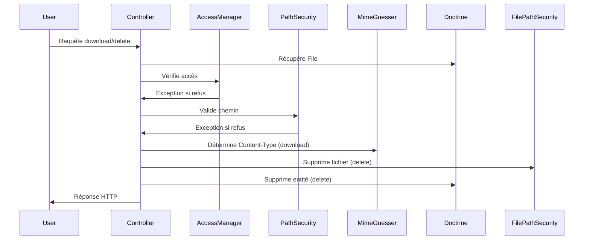

# Architecture SOLID – Contrôleur de fichiers

Ce module gère le téléchargement et la suppression de fichiers avec une séparation stricte des responsabilités (SOLID).

## Découpage des responsabilités

| Service                  | Rôle métier                                                                 |
|--------------------------|-----------------------------------------------------------------------------|
| FileAccessManager        | Vérifie les droits d’accès (Voter), logge les accès refusés                  |
| FilePathSecurity         | Valide le chemin physique, protège contre le path traversal, supprime le fichier |
| FileMimeTypeGuesser      | Détermine et sécurise le Content-Type à retourner                            |
| FileController           | Orchestration : récupère l’entité, délègue aux services, retourne la réponse |

## Diagramme d’appel

## Avantages

- Sécurité renforcée (aucune logique métier dans le contrôleur)
- Testabilité accrue (chaque service testable indépendamment)
- Facilité d’évolution (ajout de règles, logs, etc. sans toucher au contrôleur)
- Respect strict des principes SOLID

## Bonnes pratiques

- Toujours injecter les services métiers (pas d’accès direct à la logique dans le contrôleur)
- Tester chaque service indépendamment
- Documenter chaque responsabilité métier

---

🧞‍♂️ Architecture validée et conforme aux standards Home Cloud.
